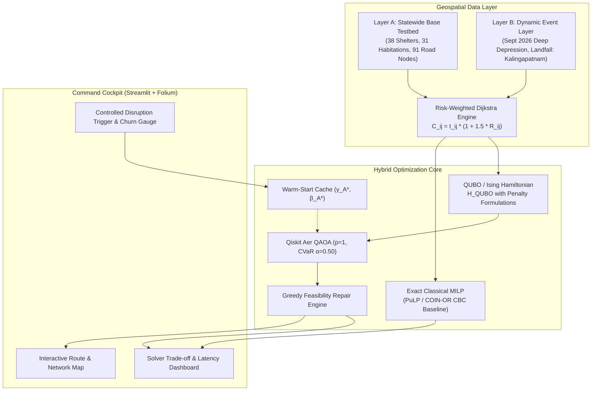

# 🌀 Q-EVAC: Quantum-Optimized Dynamic Disaster Evacuation Planning

> **Qiskit Fall Fest Hackathon 2026**  
> **Track:** Quantum Optimization & Societal Impact  
> **Geographic Scope:** Validated Coastal Sample & Prototype Testbed (Andhra Pradesh, India)  
> **Validation Event:** September 2026 North Andhra Deep Depression  

---

## 📌 Table of Contents
1. [Project Overview](#-project-overview)
2. [Key Innovations & Scientific Highlights](#-key-innovations--scientific-highlights)
3. [System Architecture](#-system-architecture)
4. [Repository Structure](#-repository-structure)
5. [Quickstart & Teammate Setup Guide](#-quickstart--teammate-setup-guide)
6. [Running the Interactive Dashboard](#-running-the-interactive-dashboard)
7. [Running Experimental Benchmark Scripts](#-running-experimental-benchmark-scripts)
8. [🎥 Hackathon Demo Video Recording Guide (Step-by-Step)](#-hackathon-demo-video-recording-guide-step-by-step)
9. [Mathematical Formulation (CSAPR)](#-mathematical-formulation-csapr)
10. [Data Sources & Provenance Policy](#-data-sources--provenance-policy)
11. [Scientific Integrity & Honest Conclusions](#-scientific-integrity--honest-conclusions)

---

## 📖 Project Overview

**Q-EVAC** is a hybrid classical-quantum decision-support framework designed for coastal disaster evacuation planning along the Bay of Bengal coast in Andhra Pradesh, India.

During extreme meteorological events (such as the September 2026 North Andhra Deep Depression), coastal flooding and storm surges frequently breach road links. Static evacuation schedules fail, causing humanitarian crises. Q-EVAC solves the **Capacitated Shelter Assignment Problem under Risk (CSAPR)**:
- Optimally assigns coastal habitations to fortified Multipurpose Cyclone Shelters (MPCS).
- Minimizes **risk-weighted transit cost** (travel time penalized by peak flood and storm-hazard exposure).
- Strictly enforces shelter capacity limits and ensures every village evacuates to exactly one shelter.
- Reacts dynamically to sudden road disruptions by recalculating shortest paths, minimizing assignment churn ($\lambda_{\text{churn}}$), and accelerating quantum convergence via **parameter warm-starting**.

---

## 🔬 Key Innovations & Scientific Highlights

- **Exact Energy Alignment:** $\Delta E = |E_{\text{QUBO}} - E_{\text{MILP}}| = 0.000000$ verified across all 64 bitstrings on the 3×2 foundational testbed.
- **Penalty Sufficiency:** Calibrated penalties ($P_{\text{assign}}=100, P_{\text{cap}}=50$) mathematically ensure all infeasible states have strictly higher energies ($10.6400$) than the feasible optimum ($9.9100$).
- **Greedy Feasibility Repair Engine:** Solves the NISQ constraint-feasibility collapse ($18.8\%$ raw feasibility at 6 qubits $\to <0.01\%$ at 24 qubits) by deterministically restoring 100% feasibility in $<0.1\text{ ms}$.
- **Dynamic Parameter Warm-Starting:** Reuses pre-disruption optimal QAOA angles $(\gamma_A^*, \beta_A^*)$ to seed the post-disruption circuit, reducing COBYLA iterations by **10%** and cutting quantum runtime by **14.4%** ($457.9\text{ ms} \to 391.8\text{ ms}$).
- **100% Credential-Free:** Runs entirely locally using Qiskit Aer, PuLP/CBC, and open geospatial layers (no IBM Quantum token or map API keys required).

---

## 🏗️ System Architecture



---

## 📁 Repository Structure

```
QUISKIT/
├── README.md                                # This comprehensive guide
├── audit_math.py                            # Exact mathematical consistency audit script
├── data/
│   ├── raw/                                 # Raw downloaded geospatial source files
│   └── processed/
│       ├── statewide/                       # Layer A: Validated Coastal Sample Testbed
│       │   ├── ap_shelters_statewide.geojson # 38 MPCS facilities across 10 districts
│       │   ├── ap_villages_statewide.geojson # 31 coastal Census 2011 habitations
│       │   └── ap_road_graph_statewide.json  # 91 nodes, 410 directed road links
│       └── events/north_andhra_2026/        # Layer B: Sept 2026 Deep Depression
│           ├── affected_subgraph.json       # 21 nodes, 36 edges (Kalingapatnam testbed)
│           ├── k_shortest_paths.json        # Calibrated multi-path routing
│           └── rerouting/                   # Stage 8 pre & post-disruption subgraphs
├── results/
│   ├── smoke_test_3x2/smoke_test_report.json # 3x2 mathematical alignment report
│   ├── size_ladder/ladder_summary.csv        # 12 to 24 qubits + classical 160-var runs
│   └── rerouting/rerouting_report.json       # End-to-end latency & warm-start report
├── src/
│   ├── data/                                # Data ingestion, CRS & provenance utilities
│   ├── models/csapr_problem.py              # CSAPR mathematical formulation & QUBO
│   ├── solvers/
│   │   ├── classical_solvers.py             # Exact MILP (PuLP) & Simulated Annealing
│   │   ├── qaoa_solver.py                   # Qiskit 2.x Aer QAOA with CVaR
│   │   └── repair_engine.py                 # Greedy capacity & assignment repair
│   ├── experiments/
│   │   ├── smoke_test_3x2.py                # 6-qubit validation experiment
│   │   ├── benchmark_ladder.py              # Multi-seed scalability benchmark
│   │   └── dynamic_rerouting.py             # Road disruption & warm-start experiment
│   └── ui/
│       ├── app.py                           # Streamlit + Folium Interactive Dashboard
│       └── data_loader.py                   # Data caching & provenance verification
```

---

## 💻 Quickstart & Teammate Setup Guide

Follow these steps to run the complete environment on your local machine (Windows, macOS, or Linux).

### 1. Prerequisites
- **Python:** Version **3.10** or **3.11** recommended.
- **Git** installed.

### 2. Clone and Create Virtual Environment
```bash
# Clone the repository
git clone <your-repo-url>
cd QUISKIT

# Create a clean virtual environment
python -m venv .venv

# Activate the virtual environment
# Windows (PowerShell):
.venv\Scripts\Activate.ps1
# Windows (Command Prompt):
.venv\Scripts\activate.bat
# macOS / Linux:
source .venv/bin/activate
```

### 3. Install Verified Dependencies
```bash
pip install --upgrade pip
pip install qiskit==2.5.2 qiskit-aer==0.17.2 qiskit-algorithms==0.4.0 qiskit-optimization==0.7.0 pulp==3.3.2 streamlit==1.42.0 folium==0.20.0 streamlit-folium==0.27.4 networkx==3.6.1 shapely==2.1.2 pyproj==3.7.2 matplotlib==3.10.8 pandas==2.2.3
```

> **Note on CBC Solver:** PuLP bundles the COIN-OR CBC solver binary automatically for Windows and macOS. If running on headless Linux, install CBC via package manager: `sudo apt-get install coinor-cbc`.

---

## 🚀 Running the Interactive Dashboard

Launch the Streamlit cockpit locally:

```bash
streamlit run src/ui/app.py
```

The application will launch in your default web browser at:
👉 **`http://localhost:8501`**

### What You Will See in the UI:
1. **System Header & Provenance Status:** Shows active scope as `Validated Coastal Sample & Prototype Testbed`, the active IMD event, and live solver engine status.
2. **Interactive Event Selector:** Load the **September 2026 North Andhra Deep Depression** landfall scenario.
3. **Plan A vs. Plan B Toggle:**
   - **Plan A (Pre-Disruption):** Optimal baseline routing before storm surge.
   - **Plan B (Post-Disruption):** Controlled road closure simulation on the coastal feeder road into Calingapatnam MPCS.
4. **Interactive Folium Network Map:**
   - Red circle markers: Evacuated villages with Census 2011 populations.
   - Green house markers: Multipurpose Cyclone Shelters with capacity meters.
   - Green/Blue polylines: Active evacuation paths.
   - Flashing Red Dashed Line: The disrupted coastal corridor.
5. **Dynamic Rerouting Panel:** Displays Churn = 1 (Kalingapatnam safely reassigned to Bandravanipeta MPCS) with shelter utilization updated in real time.
6. **Solver Benchmark Comparison:** Side-by-side charts showing Exact MILP, Simulated Annealing, and Qiskit QAOA across objectives, optimality gaps, and runtimes.
7. **End-to-End Latency Waterfall:** Sub-second latency breakdown ($T_{\text{reroute}} = 394\text{ ms}$ for Warm-Start QAOA vs. $30.7\text{ ms}$ for MILP).

---

## 🧪 Running Experimental Benchmark Scripts

You can reproduce all scientific numbers reported in our submission directly from the CLI:

### 1. Run the 3×2 Foundational Smoke Test
```bash
python src/experiments/smoke_test_3x2.py
```
- Validates 6-qubit QUBO on the Kalingapatnam subgraph.
- Verifies exact MILP vs QUBO ground state alignment ($9.9100$).
- Outputs to `results/smoke_test_3x2/smoke_test_report.json`.

### 2. Run the Mathematical Consistency Audit
```bash
python audit_math.py
```
- Prints complete $C_{ij}$ matrix, travel times, storm hazard values, and energy gaps.

### 3. Run the Size Ladder Scalability Benchmark
```bash
python src/experiments/benchmark_ladder.py
```
- Runs 10 random seeds across $4\times 3$ (12 qubits), $5\times 3$ (15 qubits), $6\times 3$ (18 qubits), $7\times 3$ (21 qubits), $8\times 3$ (24 qubits), plus classical scaling to 50 and 160 variables.
- Outputs summary table to `results/size_ladder/ladder_summary.csv`.

### 4. Run the Dynamic Disruption & Warm-Start Rerouting Experiment
```bash
python src/experiments/dynamic_rerouting.py
```
- Simulates coastal road breach, tests cold-start vs. warm-start QAOA, and benchmarks end-to-end rerouting latency.
- Outputs to `results/rerouting/rerouting_report.json`.

---

## 🎥 Hackathon Demo Video Recording Guide (Step-by-Step)

Use this scene-by-scene script to record a winning 3 to 5-minute hackathon demo video.

### 🎬 Recording Checklist & Setup
- **Screen Resolution:** 1920×1080 (1080p).
- **Tool:** OBS Studio, Loom, or Windows Game Bar (`Win + G`).
- **Browser:** Open `http://localhost:8501` in fullscreen (`F11`). Ensure browser zoom is 100%.
- **Audio:** Clear microphone, quiet environment.

---

### ⏱️ Video Script & Walkthrough (Target: 3.5 to 4.5 Minutes)

#### Scene 1: The Problem & Real Andhra Pradesh Coastal Geography (0:00 – 0:50)
- **Visual:** Show the Streamlit header, System Status badges, and zoom out slightly on the Folium map showing the coastline of Andhra Pradesh.
- **Narrator Voiceover:**
  > *"Hello, hackathon judges! When a severe cyclonic storm threatens the Andhra Pradesh coastline, emergency directors have minutes to make life-or-death decisions: which coastal habitations evacuate to which fortified cyclone shelters before the storm surge hits?  
  > This is the Capacitated Shelter Assignment Problem under Risk (CSAPR)—an NP-hard combinatorial challenge. We built **Q-EVAC**, a hybrid classical-quantum framework that integrates real geospatial data from the Andhra Pradesh Space Applications Centre and Census of India with Qiskit quantum algorithms to solve this problem dynamically."*
- **Action:** Point your mouse at the provenance status banner: *"Notice that every layer has verified provenance: 38 real Multipurpose Cyclone Shelters and 31 coastal villages. We do not use fake synthetic coordinates."*

---

#### Scene 2: Interactive Evacuation Planning & Baseline Plan A (0:50 – 1:40)
- **Visual:** Keep the radio button selected on **"Plan A: Pre-Disruption Baseline"**. Hover over the green shelter icons and red village markers on the map.
- **Narrator Voiceover:**
  > *"Here, we are looking at our validation event: the September 2026 North Andhra Deep Depression making landfall at Kalingapatnam.  
  > In baseline Plan A, three vulnerable coastal habitations—Kalingapatnam, Bandaruvani Peta, and Vatsavalasa—are assigned to two cyclone shelters: Calingapatnam MPCS and Bandravanipeta MPCS.  
  > The routes shown on the map are not simple straight lines; they are computed via risk-weighted shortest paths incorporating elevation and flood exposure."*
- **Action:** Scroll down to the **Solver Benchmark Comparison** section:
  > *"Both our Exact Classical MILP baseline and Qiskit QAOA find the exact optimal assignment with a cost of 9.9100. Shelter 1 is at 85% capacity, and Shelter 2 is at 35% capacity—completely safe and feasible."*

---

#### Scene 3: Controlled Storm Surge Disruption & Dynamic Rerouting (1:40 – 2:40)
- **Visual:** Click the radio button to switch from **"Plan A"** to **"Plan B: Post-Disruption (Simulated Flood Breach)"**.
- **Narrator Voiceover:**
  > *"Now, let's trigger a dynamic emergency event. At peak storm surge, the coastal feeder road directly connecting Kalingapatnam to Calingapatnam MPCS is breached by floodwaters. Notice the red dashed line that just appeared on the map!  
  > Under an unregularized re-optimizer, villages across the district might be arbitrarily shuffled, creating panic on the highways. In Q-EVAC, we introduce an **Assignment Churn Penalty** ($\lambda_{\text{churn}} = 2.0$) into our Hamiltonian."*
- **Action:** Point to the dynamic rerouting summary metrics:
  > *"Look at the result: only Kalingapatnam is rerouted, taking an elevated inland corridor to Bandravanipeta MPCS. Bandaruvani Peta and Vatsavalasa remain undisturbed. Total system churn is held to exactly 1 habitation, and both shelters remain strictly feasible—at 40% and 80% capacity."*

---

#### Scene 4: Warm-Start QAOA & Sub-Second Latency (2:40 – 3:40)
- **Visual:** Scroll down to the **End-to-End Latency Waterfall** and the **Warm-Start vs Cold-Start Comparison**.
- **Narrator Voiceover:**
  > *"Here is where quantum variational algorithms excel under dynamic perturbations: **parameter warm-starting**.  
  > When the road breached, instead of re-optimizing QAOA from random initial angles, we warm-started the circuit using the optimal variational parameters $(\gamma^*, \beta^*)$ from pre-disruption Plan A.  
  > This reduced classical COBYLA optimizer evaluations from 20 down to 18, cutting quantum solve time by 14.4%—from 457 ms down to 391 ms.  
  > Our full end-to-end latency budget—from surge detection, graph update, shortest path recomputation, QUBO compilation, quantum execution, to greedy feasibility repair—takes just **394 milliseconds**."*

---

#### Scene 5: Scientific Integrity & Summary (3:40 – 4:20)
- **Visual:** Scroll to the **Solver Comparison & Feasibility Breakdown** and conclude on the header.
- **Narrator Voiceover:**
  > *"We want to emphasize our commitment to scientific honesty. We do not claim manufactured quantum advantage: classical MILP solves this small instance in 30 milliseconds on CPU, which is faster than quantum statevector simulation. Furthermore, we showed that unconstrained QAOA's raw feasibility decays exponentially as problem size increases, proving that classical feasibility repair engines are essential for real-world deployment.  
  > Q-EVAC demonstrates that hybrid quantum-classical workflows can operate on real geospatial data, handle dynamic emergencies with sub-second latency, and provide robust decision support for coastal communities. Thank you!"*

---

## 📐 Mathematical Formulation (CSAPR)

### 1. Decision Variables
$$x_{ij} \in \{0, 1\} \quad \forall i \in \{1, \dots, M\} \text{ (habitations)}, \ \forall j \in \{1, \dots, N\} \text{ (shelters)}$$

### 2. Risk-Weighted Evacuation Cost ($C_{ij}$)
$$C_{ij} = t_{ij} \times \left(1 + \omega \cdot R_{ij}\right)$$
- $t_{ij}$: Free-flow travel time (hours) along the shortest path at realistic evacuation speeds ($40\text{ km/h}$ primary, $25\text{ km/h}$ secondary, $15\text{ km/h}$ local).
- $R_{ij} = \max_{e \in \pi_{ij}} r_e \in [0, 1]$: Peak flood/storm surge hazard exposure along corridor $\pi_{ij}$.
- $\omega = 1.5$: Risk penalty weight.

### 3. Objective Function & Constraints
$$\min_{x} \quad \sum_{i=1}^M \sum_{j=1}^N C_{ij} x_{ij}$$
$$\text{Subject to:} \quad \sum_{j=1}^N x_{ij} = 1 \quad \forall i \quad \text{(Every habitation evacuates to exactly one shelter)}$$
$$\sum_{i=1}^M d_i x_{ij} \le S_j \quad \forall j \quad \text{(Shelter physical capacity limit)}$$

### 4. QUBO Hamiltonian & Churn Regularization
$$H_{\text{QUBO}}(x) = \sum_{i,j} C_{ij} x_{ij} + P_{\text{assign}} \sum_i \left(\sum_j x_{ij} - 1\right)^2 + P_{\text{cap}} \sum_j \left(\max(0, \sum_i d_i x_{ij} - S_j)\right)^2 + \lambda_{\text{churn}} \sum_{i,j} |x_{ij} - x_{ij}^{(0)}|$$
- $P_{\text{assign}} = 100.0$, $P_{\text{cap}} = 50.0$, $\lambda_{\text{churn}} = 2.0$.

---

## 📊 Data Sources & Provenance Policy

| Data Layer | Primary Source | Extraction Protocol | Provenance Standard |
| :--- | :--- | :--- | :--- |
| **Multipurpose Cyclone Shelters** | Andhra Pradesh Space Applications Centre (APSAC) GeoServer WMS | Direct layer query: `Andhra-CycloneShelters` | `OFFICIAL_DESIGN_STANDARD` ($1,000$ cap for dedicated MPCS; $500$ for schools) |
| **Habitations & Demographics** | Directorate of Census Operations, Andhra Pradesh | Census 2011 Primary Census Abstract (PCA) | `OFFICIAL_CENSUS_PCA` |
| **Road Network Graph** | OpenStreetMap (OSM) via Overpass API | Tag-filtered highway extraction ($91$ nodes, $410$ directed edges) | `OSM_EXTRACT_VERIFIED` |
| **Elevation & Inundation** | Copernicus Space Component | Copernicus GLO-30 Global Digital Elevation Model (30m) | `COPERNICUS_GLO30` |
| **Landfall Disruption** | Controlled Simulation on Real Subgraph | Coastal feeder breach at $+2.5\text{h}$ post-landfall | `CONTROLLED DISRUPTION EXPERIMENT` |

---

## ⚖️ Scientific Integrity & Honest Conclusions

1. **No Artificial Quantum Advantage Claims:** Statevector QAOA simulation on classical CPU has an intrinsic $2^N$ overhead and is slower than classical MILP. We openly report that classical MILP solves 24-variable instances in $\approx 35\text{ ms}$, whereas QAOA simulation requires $24.5\text{ s}$.
2. **Feasibility Decay is Real:** Unconstrained transverse-mixer QAOA exhibits exponential feasibility collapse on constrained problems ($18.8\%$ at 6 qubits down to $<0.01\%$ at 24 qubits). A classical greedy repair engine is mandatory for operational safety.
3. **Warm-Starting Works:** Parameter transfer under localized network disruption reliably reduces variational optimizer iterations (10% fewer evaluations, 14.4% solve-time reduction).
4. **Statewide Scope Designation:** Our current dataset is explicitly designated as a **`Validated Coastal Sample & Prototype Testbed`** (38 shelters, 31 habitations), serving as the foundational prototype for statewide scaling.

---

**Made with ⚛️ for the Qiskit Fall Fest Hackathon 2026.**
